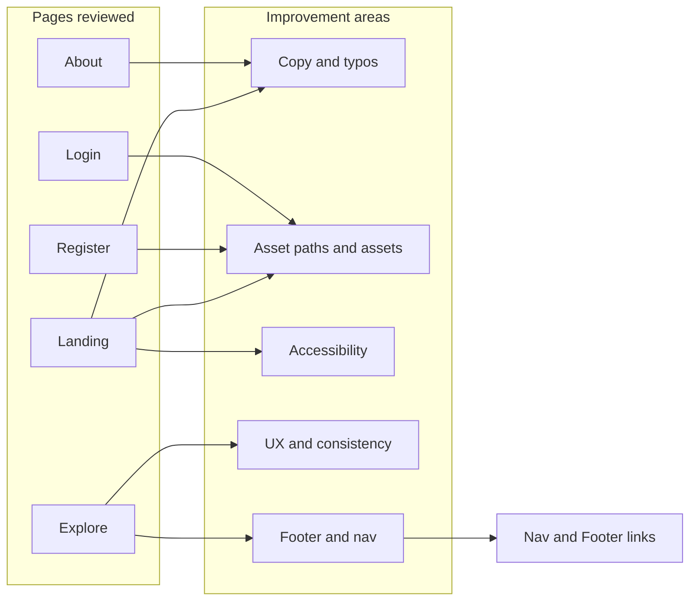

# Improvement Plan: Landing, Explore, About, Register & Login

## 1. Landing Page ([LandingView.vue](Frontend/SkillsBridge/src/views/LandingView.vue))

### Content and copy

- **Hero headline**: Fix broken structure and spacing. The line "Turn your Skills & Degree into   opportunities" has a trailing empty `` with gradient styling and no text, and double space before "opportunities". Either remove the span or add the missing word (e.g. "opportunities" in the gradient span) and fix spacing.
- **CTA button**: "Create your portfolio  It's free" has a double space; use "Create your portfolio — It's free" or "Create your portfolio. It's free".
- **Stats section**: "40K+ Faculty Trained" feels off for a student-portfolio product; consider replacing with something like "Recruiters" or "Mentors" or align the copy with your actual metrics. Ensure numbers are either real or clearly placeholders (e.g. "Live stats coming soon").
- **Trust and hiring sections**: "Trusted by leading institutions" shows university logos (AMEU, BlueCrest, etc.). The "Companies hiring from SkillsBridge" section reuses the same logos, which reads as universities, not companies. Either use different assets for hiring companies or rename that section (e.g. "Partner institutions") and avoid misleading "Companies hiring" wording.
- **Testimonials**: The testimonial block shows a static placeholder (play button, no real video). Either add real testimonial videos or replace with text testimonials / quotes so the section doesn’t feel unfinished.
- **Videos**: The same file (`skills bridge video.mp4`) is used in five places. Consider one hero or feature autoplay and the rest as click-to-play to reduce noise and improve performance. Use distinct thumbnails or titles so each block feels intentional.

### UI and styling

- **Tailwind gradient classes**: The template uses `bg-linear-to-b`, `bg-linear-to-br`, `bg-linear-to-r`, `bg-linear-to-t`. Standard Tailwind uses `bg-gradient-to-`*. If gradients don’t render, replace with `bg-gradient-to-b`, `bg-gradient-to-br`, etc.
- **Invalid Tailwind classes**: `font-semibol` → `font-semibold`; `w-100` / `w-85` are not valid (use e.g. `w-24`, `max-w-[100px]`, or explicit width); `text-2x1` in the final CTA → `text-2xl`.
- **Final CTA section**: Background is `bg-primary-600` with `text-blue-500` / `text-black` / `text-blue-600`. Check contrast (e.g. WCAG) and ensure "Ready to get discovered?" and body text are readable.

### Assets and behavior

- **Public assets (Vite)**: Images and video use paths like `/public/AmeuLogo.PNG` and `/public/skills bridge video.mp4`. In Vite, files in `public/` are served from the root, so use `/AmeuLogo.PNG` and `/skills bridge video.mp4` (or rename file to avoid spaces). Verify all logo and video paths.
- **Newsletter**: `handleNewsletterSubmit` has a TODO and only clears the field; wire to backend or an email service and show success/error feedback.

### Accessibility

- **Autoplay**: Multiple `autoplay` videos can be disruptive. Prefer one autoplay (muted) and the rest without autoplay.
- **Testimonial carousel**: Ensure dots/buttons have clear labels (you already have `aria-label` on dots; keep play button accessible if it becomes functional).

---

## 2. Explore Page ([ExploreView.vue](Frontend/SkillsBridge/src/views/ExploreView.vue))

### UX and functionality

- **Search input**: Add a visible `label` (e.g. "Search by skill") and associate it with the input for accessibility; `BaseInput` supports a `label` prop.
- **Pagination**: Styling is ad hoc (plain buttons). Use `BaseButton` or shared pagination component for consistency and hover/disabled states.
- **Sorting**: No way to sort (e.g. by name, recently updated). Consider adding a "Sort by" control and wiring to the explore API if supported.
- **URL state**: Filters (university, skill, page) are not reflected in the URL. Add query params (e.g. `?university=...&skill=...&page=...`) so results are shareable and back/forward work as expected.

### Layout and consistency

- **Footer**: Landing and About use `AppFooter`; Explore does not. Add `AppFooter` to Explore for consistent layout and navigation.

### Empty state

- When there are no profiles, consider a secondary CTA (e.g. "Create your profile" linking to Register) so the empty state is actionable.

---

## 3. About Page ([AboutView.vue](Frontend/SkillsBridge/src/views/AboutView.vue))

### Content

- **Depth**: Copy is clear but short. Optional additions: a short "Why we built this" or "Our story," team/leadership snippet, or contact (e.g. support/partnership email) so visitors know how to reach you.

### Footer links (global)

- Footer "Privacy" and "Terms" point to `#`. Either add `/privacy` and `/terms` routes and pages or remove the links until they exist.

---

## 4. Register Page ([RegisterView.vue](Frontend/SkillsBridge/src/views/RegisterView.vue))

### Visual

- **Logo**: Left panel uses a placeholder `
`. Replace with the same SkillsBridge logo as in the navbar ([AppNavbar.vue](Frontend/SkillsBridge/src/components/layout/AppNavbar.vue) uses `/public/SkillsBridge Logo.jpeg`) for consistency. Fix path to Vite public convention (e.g. `/SkillsBridge Logo.jpeg` if the file lives in `public/`).

### Functionality

- Form validation, university request modal, and CTAs are in good shape; no major logic changes needed.

---

## 5. Login Page ([LoginView.vue](Frontend/SkillsBridge/src/views/LoginView.vue))

### Visual

- **Logo**: Same as Register — replace the left-panel placeholder with the SkillsBridge logo and use correct public path.

### Behavior

- Redirect after login (including `route.query.redirect` and admin vs dashboard) is implemented correctly. Optional: add a "Forgot password?" link when that flow exists.

---

## 6. Global / Shared

### AppNavbar ([AppNavbar.vue](Frontend/SkillsBridge/src/components/layout/AppNavbar.vue))

- **Casing**: "LogIn" → "Log in" for consistency with Login page and footer (which uses "Log in" in some places).

### AppFooter ([AppFooter.vue](Frontend/SkillsBridge/src/components/layout/AppFooter.vue))

- **Links**: "LogIn" → "Log in".
- **Privacy / Terms**: Replace `#` with real routes when pages exist, or remove until then.

### Navigation

- Nav items use `<button @click="goHome">` etc., so they don’t get right-click "Open in new tab" or native link semantics. Consider switching to `<router-link>` for Home, Explore, About (and keep buttons for auth actions if preferred) for better accessibility and UX.

---

## Summary diagram

---

## Suggested priority

1. **High**: Hero and CTA copy/typos, Tailwind/invalid class fixes, public asset paths (Vite), testimonial/hiring section clarity, newsletter TODO.
2. **Medium**: Explore labels and pagination, URL state for Explore, footer on Explore, logo on Register/Login, LogIn → Log in.
3. **Lower**: About expansion, Privacy/Terms pages or removal, router-link for nav, sort on Explore, forgot password when backend exists.

